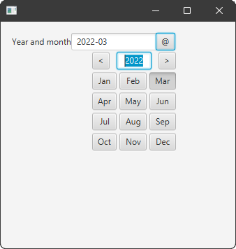

# fx-ym-picker

A year and month picker component for JavaFX.

This component was tested with JDK 17 and JavaFX runtime 17.0.1.

## Customization

Popup content can be customized by using factory function passed into constructor.

    YearMonthPicker(YearMonth value, 
            Function<YearMonthPicker, ? extends YearMonthPickerContent> contentFactory)

## Styling

"yearmonth-picker" - default style class for YearMonthPicker.

"yearmonth-picker-content" - default style class for Popup content of the picker.

"btn-prev" - style class for the previous year button

"btn-next" - style class for the next year button

"input-year" - style class for the year input field

"btn-month" - style class for month buttons
